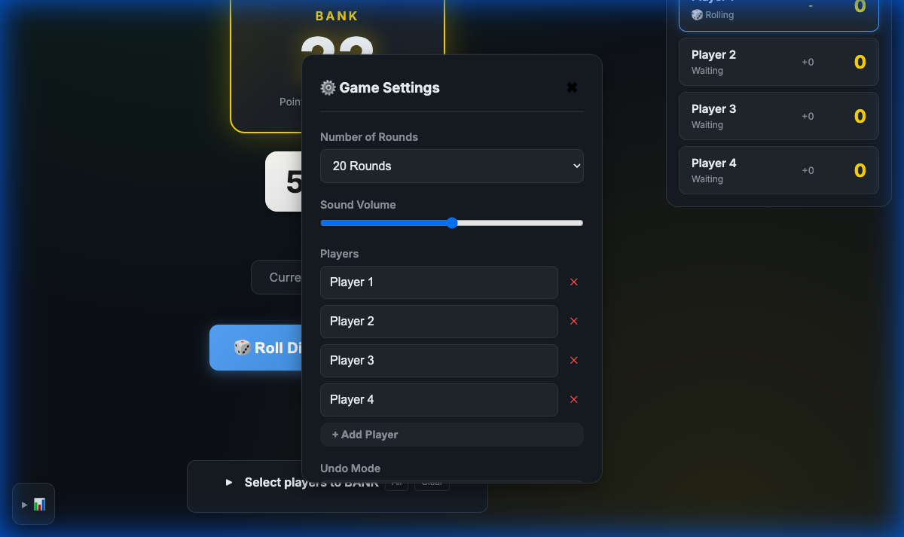
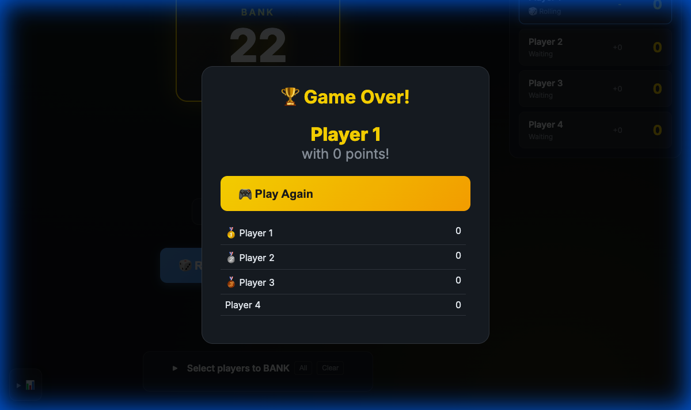

# Bank - Dice Game

A web-based implementation of the "Bank" dice game, based on rules from [ThunderHive Games](https://www.thunderhivegames.com/).


## How to Play

### Objective
Be the player with the most BANKED points after 1, 5, 10, 15, or 20 rounds!

### Setup
1. Add player names (2+ players)
2. Choose number of rounds 
3. Start rolling!

### Gameplay

1. **Roll**: Click "Roll Dice" or press SPACE to roll both dice
2. **Score Accumulates**: Each roll's sum is added to the BANK
3. **BANK Your Points**: Click "BANK!" (or press B) to claim the current BANK score
4. **Sit Out**: Once you BANK, you sit out the rest of the round
5. **Next Round**: Round ends when a 7 is rolled OR everyone has banked

### Special Rules

| Roll | First 3 Rolls | After 3 Rolls |
|------|---------------|---------------|
| **7** | +70 points to BANK | Round ENDS (all unbanked points lost!) |
| **Doubles** | Face value only (e.g., 4+4 = +8) | DOUBLES the entire BANK! |

The first three rolls have "protection" - you can't lose to a 7 early!

### Winning
After all rounds complete, the player with the highest score wins!

## Features

### Core Gameplay
- **Manual Rolling**: Click to roll (no automatic timer)
- **Multi-Select Banking**: After roll 3, select multiple players and bank them all at once
- **Undo**: Undo last action with Ctrl+Z (supports re-sample or preserve modes)
- **Keyboard Shortcuts**: SPACE to roll, B to bank, Ctrl+Z to undo

### UI & Visual
- **Collapsible Stats Dashboard**: Probability info in a collapsible panel
- **Collapsible Bank Panel**: Player selection in an expandable dropdown
- **Summary Scoreboard**: Toggle between full and summary views with gap calculations
- **Visual Feedback**: Dice animations, score pulses, status indicators
- **Gap Column**: Scoreboard shows "+X to tie" for each player vs leader
- **Mobile Responsive**: Touch-friendly targets, responsive layouts

### Configuration
- **JSON Import/Export**: Save and load game configurations
- **Deterministic Testing**: Seed support for reproducible gameplay
- **Sample Configurations**: Pre-built JSON files for quick setup



### Probability Dashboard
- **Survival probability**: Shows (5/6)^rollNumber = odds of no 7 so far
- **Risk per roll**: Constant 16.67% (1/6) chance of rolling 7
- **Cheatsheet**: Collapsible table with all 2d6 probabilities (2-12)

### Summary Scoreboard
Toggle to a compact view showing:
- Current player's score
- Points needed to tie next player
- Points needed to tie leader
- Rankings with tie handling


### Game Over Modal

When all rounds complete, a Game Over modal displays:
- Winner announcement
- Play Again button (fixed at top)
- Scrollable final scoreboard (supports many players)



## Default Configuration

```json
{
  "name": "bank-game-config",
  "version": "1.0",
  "seed": 12345,
  "settings": {
    "totalRounds": 20,
    "volume": 50,
    "undoMode": "resample"
  },
  "players": [
    { "id": 1, "name": "Player 1" },
    { "id": 2, "name": "Player 2" },
    { "id": 3, "name": "Player 3" },
    { "id": 4, "name": "Player 4" }
  ],
  "deterministic": {
    "seed": 12345,
    "maxRolls": null,
    "expectedFinalScores": null
  }
}
```

## Files

| File | Description |
|------|-------------|
| `index.html` | Game UI and structure |
| `style.css` | Visual styling (dark theme) |
| `script.js` | BankGame class and logic |
| `seeded-tests.spec.js` | Playwright test suite (28 tests) |
| `enhancements.md` | Proposed future enhancements |
| `sample configuration files/` | Pre-built JSON configs |

## Testing

Run the seeded tests with:
```bash
./node_modules/.bin/playwright test apps/games/Bank/seeded-tests.spec.js --project=tests
```

All 28 tests cover:
- Core game mechanics
- Dice rolling behavior
- First 3 roll protection
- Doubles scoring
- Banking functionality
- Round progression
- Game completion
- Multi-player banking
- Settings

## Strategy Tips

1. **Early Rolls Are Safe**: Use the first 3 rolls to build the bank without risk
2. **Watch for Doubles**: After roll 3, doubles can massively increase the bank
3. **Bank Before 7**: The odds of rolling a 7 are 1/6 (16.7%) - don't be greedy!
4. **Let Others Risk**: If the bank is high, consider banking early and letting others take the risk
5. **Last Player Advantage**: The last unbanked player can keep rolling and take all remaining points

## Credits

Game rules adapted from [ThunderHive Games](https://www.thunderhivegames.com/) BANK app.
