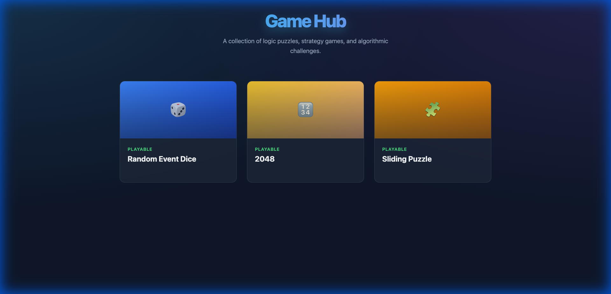
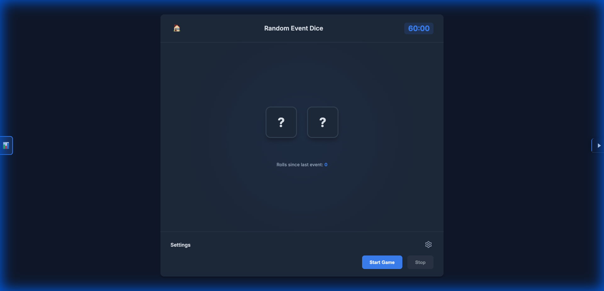
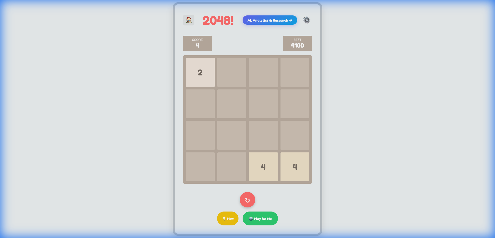
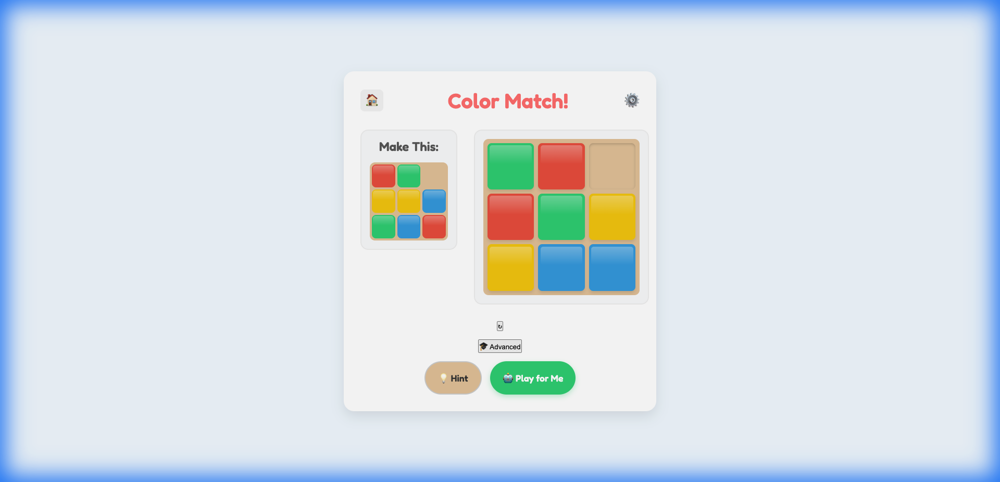
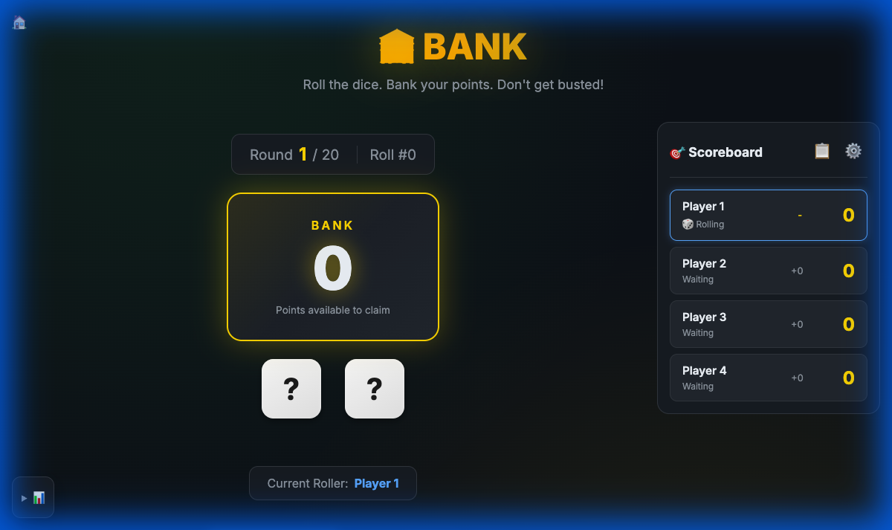

# Game Hub

A collection of logic puzzles, strategy games, and algorithmic challenges built with **React**, **Vite**, and **Tailwind CSS**.

**Live Demo**: [Play the Games Here](https://joeywilkes12.github.io/Games-01-public/index.html)

---

## 🎮 Game Gallery

### Game Hub


### Random Event Dice


### 2048


### Sliding Puzzle 3x3


### Bank


---

## 🎯 Playable Games

| Game | Description |
|------|-------------|
| [Random Event Dice](/games/random-event-dice) | Multi-player dice rolling game with analytics dashboard, heatmaps, and leaderboard |
| [2048](/games/2048) | Single-player sliding block puzzle with Expectimax AI solver |
| [Sliding Puzzle](/games/sliding-puzzle) | Classic 3x3 sliding tile puzzle with A* solver |
| [Bank](/games/bank) | Multiplayer dice game with undo/redo and probability cheatsheet |

## 🚧 Coming Soon
- Acquire
- Mastermind
- Queens
- Wordle
- Risk

---

## 🛠️ Technology Stack

- **React 18** - UI components
- **Vite 6** - Build tool and dev server
- **Tailwind CSS 3** - Utility-first styling
- **React Router 6** - Client-side routing
- **Playwright** - E2E testing

## 📱 Mobile-First Design

This application is designed with mobile-first principles:
- Responsive layouts that adapt from 320px to 1280px+
- Touch-friendly targets (minimum 44x44px)
- Optimized animations and transitions
- See [claude.md](claude.md) for detailed guidelines

---

## 🚀 Development

### Prerequisites
- Node.js 18+
- npm 9+

### Quick Start

```bash
# Install dependencies
npm install

# Start development server
npm run dev

# Build for production
npm run build

# Preview production build
npm run preview
```

### Testing

```bash
# Run all tests
npm test

# Run tests with visible browser
npm run test:headed

# Run full demo recording
npm run demo
```

See [tests.md](tests.md) for complete test documentation.

---

## 📁 Project Structure

```
.
├── src/
│   ├── components/     # Shared UI components
│   ├── games/          # Individual games
│   │   ├── Bank/
│   │   ├── Game2048/
│   │   ├── RandomEventDice/
│   │   └── SlidingPuzzle/
│   ├── pages/          # Page components
│   ├── App.jsx         # Router configuration
│   ├── main.jsx        # Entry point
│   └── index.css       # Tailwind styles
├── _original/          # Original vanilla JS version (backup)
├── tests/              # Playwright test specs
├── to_developer/       # Developer documentation
│   ├── developer.md    # Getting started guide
│   └── alternatives.md # Alternative frameworks
├── claude.md           # Mobile-first development guidelines
└── package.json
```

---

## 📚 Developer Documentation

New to React, Vite, or Tailwind? Check out our comprehensive guides:

| Document | Description |
|----------|-------------|
| [Developer Guide](to_developer/developer.md) | Complete introduction to the stack, local development, and GitHub Pages deployment |
| [Alternatives Guide](to_developer/alternatives.md) | Comparison of alternative frameworks and deployment platforms |
| [Mobile-First Guidelines](claude.md) | Design principles and responsive patterns |
| [Testing Documentation](tests.md) | How to run and write tests |

---

## 🎲 Game Details

### Bank
A multiplayer dice game based on rules from [ThunderHive Games](https://www.thunderhivegames.com/). Players take turns rolling dice to accumulate points in a shared "bank", then strategically decide when to claim those points. Features:
- Multi-player with configurable names
- Undo/redo with resample or preserve modes
- BYOD (Bring Your Own Dice) mode
- Probability cheatsheet

### 2048
A single-player sliding block puzzle using numbered tiles. Features:
- Expectimax AI solver
- Multiple themes
- Seeded randomness for reproducible runs

### Sliding Puzzle 3x3
A classic sliding tile puzzle. Features:
- A* pathfinding solver
- Kids mode (colored tiles) and Advanced mode (numbered)
- Move counter and optimal move display

### Random Event Dice
A multiplayer dice game with analytics. Features:
- Configurable game duration and roll interval
- Real-time leaderboard
- Roll distribution heatmap
- Skip to end simulation

---

## 🙏 Acknowledgements

This project was developed with significant assistance from advanced AI tools including:
- **Antigravity** with Gemini 3 Pro and Claude Opus 4.5
- **Playwright** for E2E testing

---

## 📄 License

MIT License - See LICENSE file for details.

## 🔗 Links

- [GitHub Repository](https://github.com/JoeyWilkes12/Games-01-public)
- [Project Overview (Notion)](https://www.notion.so/Random-Event-Dice-Game-Public-2e2692f524348040969cd794baa02219)
